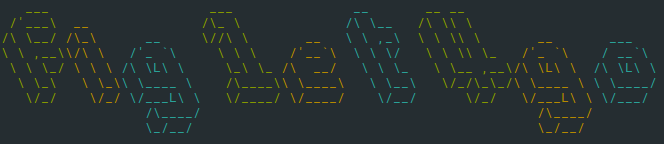

# FIGlet for Go

A port of [figlet](http://www.figlet.org/) to golang and fork of [getwe/figlet4go](https://github.com/getwe/figlet4go).



## Installation

```
go get -u github.com/probandula/figlet4go
```

## Usage

### Basic
You have to create a renderer (`ascii`) and let it render the desired string through the `Render` method. After that you can simply print the returned string.
```go
ascii := figlet4go.NewAsciiRender()

renderStr, _ := ascii.Render("Hello World")
fmt.Print(renderStr)
```

### Colored
The colors given in the `[]color.Attribute` slice are repeating if the string is longer than the slice. You have to call the `RenderOpts` instead of the `Render` method to give the Renderer the Options.
```go
ascii := figlet4go.NewAsciiRender()

// Adding the colors to RenderOptions
options := figlet4go.NewRenderOptions()
options.FontColor = []color.Attribute{
	color.FgGreen,
	color.FgYellow,
	color.FgCyan,
}

renderStr, _ := ascii.RenderOpts("Hello Colors", options)

fmt.Print(renderStr)
```

### Other font
If you want to use another font, you have to specify the name of the font as in this example.  
Is the font you want to use not [included](#builtin) you have to load the font manually with the `LoadFont` method. This method will walk the path recursively and load all `.flf` files
```go
ascii := figlet4go.NewAsciiRender()

options := figlet4go.NewRenderOptions()
options.FontName = "larry3d"

// If 'larry3d' wouldn't be included you would have to load your .flf files like that:
ascii.LoadFont("/path/to/fonts/")

renderStr, _ := ascii.RenderOpts("Hello Colors", options)

fmt.Print(renderStr)
```

## Fonts

### Bulitin
The builtin fonts are built into the `bindata.go` file with the tool [go-bindata](https://github.com/jteeuwen/go-bindata).  
The bash script for building the default font is stored in `tools/` (`go-bindata` must be installed).  
The default font is `standard`. All builtin fonts are listed here:
| Font name | Source |
| --- | --- |
| standard | http://www.figlet.org/fontdb_example.cgi?font=standard.flf |
| larry3d | http://www.figlet.org/fontdb_example.cgi?font=larry3d.flf |

### Other fonts
Other fonts can mainly be found on [figlet](http://www.figlet.org). You have to load them as in [this example](#other-fonts).


## Use the demo
There are [demo](https://github.com/probandula/figlet4go/blob/master/demo) programs for trying out the library.  
To run them, `cd` into the `demo/` directory and run `go run [filename]` on any program you want to run.

## Todo
- [ ] automatic the perfect char margin
- [ ] Linebreak possible?